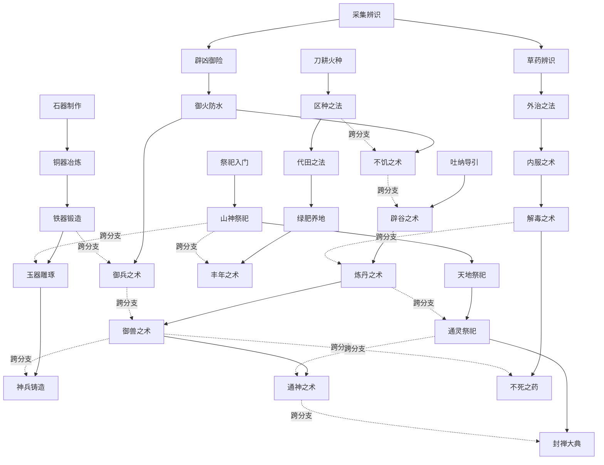

# 山海经项目 - 数值平衡仿真报告
> 自动生成于数值平衡仿真器
> 数据来源: 知识图谱 full-data.json + data 目录 4 个 JSON 文件
> 知识图谱版本: 2.0.0

---

## 目录
1. [科技树可达性仿真](#一科技树可达性仿真)
2. [材料经济仿真](#二材料经济仿真)
3. [战力曲线仿真](#三战力曲线仿真)
4. [食物链仿真](#四食物链仿真)

---

# 一、科技树可达性仿真
## 1.1 起始节点（无前置条件）
- `tech_survival_1` (采集辨识) - 分支: 生存
- `tech_cultivation_1` (吐纳导引) - 分支: 修仙
- `tech_sacrifice_1` (祭祀入门) - 分支: 祭祀
- `tech_craft_1` (石器制作) - 分支: 工匠
- `tech_farming_1` (刀耕火种) - 分支: 农牧

## 1.2 各节点最短路径（最少前置步骤）
| 节点ID | 名称 | 分支 | 层级 | 最短路径 | 状态 |
|--------|------|------|------|----------|------|
| tech_craft_1 | 石器制作 | 工匠 | 1 | 0 | 可达 |
| tech_craft_2 | 铜器冶炼 | 工匠 | 2 | 1 | 可达 |
| tech_craft_3 | 铁器锻造 | 工匠 | 3 | 2 | 可达 |
| tech_craft_4 | 玉器雕琢 | 工匠 | 4 | 2 | 可达 |
| tech_craft_5 | 神兵铸造 | 工匠 | 5 | 3 | 可达 |
| tech_cultivation_1 | 吐纳导引 | 修仙 | 1 | 0 | 可达 |
| tech_cultivation_2 | 辟谷之术 | 修仙 | 2 | 1 | 可达 |
| tech_cultivation_3 | 炼丹之术 | 修仙 | 3 | 2 | 可达 |
| tech_cultivation_4 | 御兽之术 | 修仙 | 4 | 3 | 可达 |
| tech_cultivation_5 | 通神之术 | 修仙 | 5 | 4 | 可达 |
| tech_farming_1 | 刀耕火种 | 农牧 | 1 | 0 | 可达 |
| tech_farming_2 | 区种之法 | 农牧 | 2 | 1 | 可达 |
| tech_farming_3 | 代田之法 | 农牧 | 3 | 2 | 可达 |
| tech_farming_4 | 绿肥养地 | 农牧 | 4 | 3 | 可达 |
| tech_farming_5 | 丰年之术 | 农牧 | 5 | 2 | 可达 |
| tech_medicine_1 | 草药辨识 | 医药 | 1 | 1 | 可达 |
| tech_medicine_2 | 外治之法 | 医药 | 2 | 2 | 可达 |
| tech_medicine_3 | 内服之术 | 医药 | 3 | 3 | 可达 |
| tech_medicine_4 | 解毒之术 | 医药 | 4 | 4 | 可达 |
| tech_medicine_5 | 不死之药 | 医药 | 5 | 4 | 可达 |
| tech_sacrifice_1 | 祭祀入门 | 祭祀 | 1 | 0 | 可达 |
| tech_sacrifice_2 | 山神祭祀 | 祭祀 | 2 | 1 | 可达 |
| tech_sacrifice_3 | 天地祭祀 | 祭祀 | 3 | 2 | 可达 |
| tech_sacrifice_4 | 通灵祭祀 | 祭祀 | 4 | 3 | 可达 |
| tech_sacrifice_5 | 封禅大典 | 祭祀 | 5 | 4 | 可达 |
| tech_survival_1 | 采集辨识 | 生存 | 1 | 0 | 可达 |
| tech_survival_2 | 辟凶御险 | 生存 | 2 | 1 | 可达 |
| tech_survival_3 | 御火防水 | 生存 | 3 | 2 | 可达 |
| tech_survival_4 | 不饥之术 | 生存 | 4 | 2 | 可达 |
| tech_survival_5 | 御兵之术 | 生存 | 5 | 3 | 可达 |

## 1.3 死锁检测
未发现循环依赖。

所有节点均可达。

## 1.4 科技树拓扑图


## 1.5 关键路径（最长解锁链）
最长路径长度: **4 步**
关键终点节点:
- `tech_medicine_4` (解毒之术)
- `tech_medicine_5` (不死之药)
- `tech_cultivation_5` (通神之术)
- `tech_sacrifice_5` (封禅大典)

关键路径示例:
`采集辨识` -> `草药辨识` -> `外治之法` -> `内服之术` -> `解毒之术`

---

# 二、材料经济仿真
## 2.1 材料供需平衡表
| 材料ID | 名称 | 稀有度 | 获取速率(个/时) | 需求次数 | 供需比 | 状态 |
|--------|------|--------|----------------|----------|--------|------|
| baifan | 白矾 | 普通 | 60.00 | 0 | inf | 无需求 |
| baiyin | 白银 | 普通 | 60.00 | 0 | inf | 无需求 |
| baopuzi_chanchu | 蟾蜍 | 普通 | 60.00 | 0 | inf | 无需求 |
| baopuzi_chisongzi_dan | 赤松子丹法 | 普通 | 60.00 | 0 | inf | 无需求 |
| baopuzi_dansha | 丹砂 | 普通 | 60.00 | 0 | inf | 无需求 |
| baopuzi_danyu | 丹鱼 | 普通 | 60.00 | 0 | inf | 无需求 |
| baopuzi_daoyin | 导引术 | 史诗 | 0.50 | 0 | inf | 无需求 |
| baopuzi_fudan | 伏丹法 | 普通 | 60.00 | 0 | inf | 无需求 |
| baopuzi_hou | 猕猴/猿/玃 | 普通 | 60.00 | 0 | inf | 无需求 |
| baopuzi_huangjin | 黄金 | 普通 | 60.00 | 0 | inf | 无需求 |
| baopuzi_huli | 狐狸/豺狼 | 普通 | 60.00 | 0 | inf | 无需求 |
| baopuzi_jinye | 金液法 | 传说 | 0.04 | 0 | inf | 无需求 |
| baopuzi_jiudan | 九鼎丹法 | 普通 | 60.00 | 0 | inf | 无需求 |
| baopuzi_jiuguang_dan | 九光丹法 | 史诗 | 0.50 | 0 | inf | 无需求 |
| baopuzi_jiuzhuan_dan | 九转丹法 | 传说 | 0.04 | 0 | inf | 无需求 |
| baopuzi_liuyi_ni | 六一泥 | 普通 | 60.00 | 0 | inf | 无需求 |
| baopuzi_qiannian_gui | 千岁龟 | 普通 | 60.00 | 0 | inf | 无需求 |
| baopuzi_qiannian_he | 千岁鹤 | 普通 | 60.00 | 0 | inf | 无需求 |
| baopuzi_qiannian_song | 千岁松中物 | 普通 | 60.00 | 0 | inf | 无需求 |
| baopuzi_qilin | 麒麟 | 普通 | 60.00 | 0 | inf | 无需求 |
| baopuzi_shu | 仲鼠 | 普通 | 60.00 | 0 | inf | 无需求 |
| baopuzi_wushi | 五石 | 普通 | 60.00 | 0 | inf | 无需求 |
| baopuzi_xiaodan | 小神丹方 | 传说 | 0.04 | 0 | inf | 无需求 |
| baopuzi_xiaodanfa | 小丹法 | 普通 | 60.00 | 0 | inf | 无需求 |
| baopuzi_xingqi | 行气术 | 普通 | 60.00 | 0 | inf | 无需求 |
| baopuzi_xiong | 熊 | 普通 | 60.00 | 0 | inf | 无需求 |
| baopuzi_xuanhuagao | 玄黄 | 普通 | 60.00 | 0 | inf | 无需求 |
| baopuzi_zhugcao | 朱草 | 普通 | 60.00 | 0 | inf | 无需求 |
| baopuzi_zuque | 雉/雀 | 普通 | 60.00 | 0 | inf | 无需求 |
| creature_baige | 白䓘 | 精良 | 12.00 | 0 | inf | 无需求 |
| creature_baiyuan | 白猿 | 精良 | 12.00 | 0 | inf | 无需求 |
| creature_bazhong | 巴蛇 | 传说 | 0.04 | 0 | inf | 无需求 |
| creature_bifang | 毕方 | 传说 | 0.04 | 0 | inf | 无需求 |
| creature_bo | 驳 | 稀有 | 2.00 | 1 | 2.00 | 平衡 |
| creature_boti | 猼訑 | 稀有 | 2.00 | 0 | inf | 无需求 |
| creature_boyi | 伯益 | 普通 | 60.00 | 0 | inf | 无需求 |
| creature_changfu | 长蝠 | 精良 | 12.00 | 0 | inf | 无需求 |
| creature_changyou | 长右 | 精良 | 12.00 | 0 | inf | 无需求 |
| creature_chenghuang | 乘黄 | 传说 | 0.04 | 1 | 0.04 | !! 稀缺 |
| creature_chijiu | 赤鱬 | 精良 | 12.00 | 0 | inf | 无需求 |
| creature_chiru | 赤鱬 | 精良 | 12.00 | 0 | inf | 无需求 |
| creature_congcong | 从从 | 普通 | 60.00 | 0 | inf | 无需求 |
| creature_crt_buru_niu | 不死牛 | 精良 | 12.00 | 0 | inf | 无需求 |
| creature_crt_chenggong_zhiong | 成公知琼（天上玉女） | 精良 | 12.00 | 0 | inf | 无需求 |
| creature_crt_chenghuang_shou | 乘黄 | 精良 | 12.00 | 0 | inf | 无需求 |
| creature_crt_chisongzi | 赤松子 | 精良 | 12.00 | 0 | inf | 无需求 |
| creature_crt_du_lanxiang | 杜兰香 | 精良 | 12.00 | 0 | inf | 无需求 |
| creature_crt_eyu | 鳄鱼 | 精良 | 12.00 | 0 | inf | 无需求 |
| creature_crt_fan_daoling | 樊道基 | 精良 | 12.00 | 0 | inf | 无需求 |
| creature_crt_feiyi | 肥遗 | 精良 | 12.00 | 0 | inf | 无需求 |
| creature_crt_fengshen | 风伯（箕星） | 精良 | 12.00 | 0 | inf | 无需求 |
| creature_crt_fly_car | 飞车 | 精良 | 12.00 | 0 | inf | 无需求 |
| creature_crt_ge_xuan | 葛玄 | 精良 | 12.00 | 0 | inf | 无需求 |
| creature_crt_hanxuema | 汗血马 | 精良 | 12.00 | 0 | inf | 无需求 |
| creature_crt_hebo | 河伯 | 精良 | 12.00 | 0 | inf | 无需求 |
| creature_crt_huang_gong2 | 黄公（益州之西） | 精良 | 12.00 | 0 | inf | 无需求 |
| creature_crt_huangong | 黄公 | 精良 | 12.00 | 0 | inf | 无需求 |
| creature_crt_jiaoren | 鲛人 | 精良 | 12.00 | 0 | inf | 无需求 |
| creature_crt_jingwei | 精卫 | 精良 | 12.00 | 0 | inf | 无需求 |
| creature_crt_longbo | 龙伯国人 | 精良 | 12.00 | 0 | inf | 无需求 |
| creature_crt_luotou_chong | 落头虫（虫落） | 精良 | 12.00 | 0 | inf | 无需求 |
| creature_crt_luotouchong | 落头虫 | 精良 | 12.00 | 0 | inf | 无需求 |
| creature_crt_mengshu | 猛兽 | 精良 | 12.00 | 0 | inf | 无需求 |
| creature_crt_mengshu2 | 猛兽（魏武） | 精良 | 12.00 | 0 | inf | 无需求 |
| creature_crt_mengshuang_min | 蒙双民 | 精良 | 12.00 | 0 | inf | 无需求 |
| creature_crt_niuti_yu | 牛体鱼 | 精良 | 12.00 | 0 | inf | 无需求 |
| creature_crt_qinghongjun | 青洪君 | 精良 | 12.00 | 0 | inf | 无需求 |
| creature_crt_shen_niu | 神牛（扶南） | 精良 | 12.00 | 0 | inf | 无需求 |
| creature_crt_shenniu | 神牛 | 精良 | 12.00 | 0 | inf | 无需求 |
| creature_crt_sheshegong | 射工虫 | 精良 | 12.00 | 0 | inf | 无需求 |
| creature_crt_shimen | 师门 | 精良 | 12.00 | 0 | inf | 无需求 |
| creature_crt_shouguang_hou | 寿光侯 | 精良 | 12.00 | 0 | inf | 无需求 |
| creature_crt_shuanran | 率然 | 精良 | 12.00 | 0 | inf | 无需求 |
| creature_crt_taishan_nu | 泰山之女 | 精良 | 12.00 | 0 | inf | 无需求 |
| creature_crt_tuoling | 驼铃（驢鼠） | 精良 | 12.00 | 0 | inf | 无需求 |
| creature_crt_weishe | 委蛇 | 精良 | 12.00 | 0 | inf | 无需求 |
| creature_crt_wenma | 文马（吉黄之乘） | 精良 | 12.00 | 0 | inf | 无需求 |
| creature_crt_wu_meng | 吴猛 | 精良 | 12.00 | 0 | inf | 无需求 |
| creature_crt_wuqi_min | 无启民 | 精良 | 12.00 | 0 | inf | 无需求 |
| creature_crt_wuquan | 猴玃（马化/猳玃） | 精良 | 12.00 | 0 | inf | 无需求 |
| creature_crt_xingxing | 猩猩 | 精良 | 12.00 | 0 | inf | 无需求 |
| creature_crt_yediao | 冶鸟 | 精良 | 12.00 | 0 | inf | 无需求 |
| creature_crt_yuji | 于吉 | 精良 | 12.00 | 0 | inf | 无需求 |
| creature_crt_yushi | 雨师（毕星/屏翳/玄冥） | 精良 | 12.00 | 0 | inf | 无需求 |
| creature_crt_zhuque | 朱雀 | 精良 | 12.00 | 0 | inf | 无需求 |
| creature_dangkang | 当康 | 精良 | 12.00 | 0 | inf | 无需求 |
| creature_danmu | 丹木 | 稀有 | 2.00 | 0 | inf | 无需求 |
| creature_dashe | 大蛇 | 稀有 | 2.00 | 0 | inf | 无需求 |
| creature_dijiang | 帝江 | 传说 | 0.04 | 1 | 0.04 | !! 稀缺 |
| creature_duheng | 杜衡 | 普通 | 60.00 | 0 | inf | 无需求 |
| creature_ershu | 耳鼠 | 稀有 | 2.00 | 1 | 2.00 | 平衡 |
| creature_fei_dongshan | 蜚 | 传说 | 0.04 | 0 | inf | 无需求 |
| creature_feishu | 飞鼠 | 普通 | 60.00 | 0 | inf | 无需求 |
| creature_feiyi | 肥𧔥 | 传说 | 0.04 | 0 | inf | 无需求 |
| creature_feiyi_snake | 肥遗（蛇） | 精良 | 12.00 | 0 | inf | 无需求 |
| creature_feiyu_zhongshan | 飞鱼（中山） | 精良 | 12.00 | 1 | 12.00 | 过剩 |
| creature_fenghuang | 凤皇 | 传说 | 0.04 | 1 | 0.04 | !! 稀缺 |
| creature_fuchong | 蝗虫 | 普通 | 60.00 | 0 | inf | 无需求 |
| creature_fuxi | 凫徯 | 精良 | 12.00 | 0 | inf | 无需求 |
| creature_fuzhu | 夫诸 | 稀有 | 2.00 | 0 | inf | 无需求 |
| creature_guaimu | 怪木 | 普通 | 60.00 | 0 | inf | 无需求 |
| creature_guainiao | 怪鸟 | 普通 | 60.00 | 0 | inf | 无需求 |
| creature_guaishe | 怪蛇 | 普通 | 60.00 | 0 | inf | 无需求 |
| creature_guaishou | 怪兽 | 普通 | 60.00 | 0 | inf | 无需求 |
| creature_guaiyu | 怪鱼 | 普通 | 60.00 | 0 | inf | 无需求 |
| creature_guanguan | 灌灌 | 精良 | 12.00 | 0 | inf | 无需求 |
| creature_gudiao | 蛊雕 | 精良 | 12.00 | 0 | inf | 无需求 |
| creature_gurong | 蓇蓉 | 精良 | 12.00 | 0 | inf | 无需求 |
| creature_haozhu | 毫彘 | 精良 | 12.00 | 0 | inf | 无需求 |
| creature_heluo | 何罗之鱼 | 稀有 | 2.00 | 0 | inf | 无需求 |
| creature_heyu | 合窳 | 稀有 | 2.00 | 0 | inf | 无需求 |
| creature_huahuai | 猾褢 | 精良 | 12.00 | 0 | inf | 无需求 |
| creature_huaimu | 櫰木 | 精良 | 12.00 | 0 | inf | 无需求 |
| creature_huan | 䍺 | 稀有 | 2.00 | 0 | inf | 无需求 |
| creature_huan_beishan | 欢 | 稀有 | 2.00 | 0 | inf | 无需求 |
| creature_huanxu | 䑏䟽 | 精良 | 12.00 | 0 | inf | 无需求 |
| creature_huayu | 滑鱼 | 普通 | 60.00 | 0 | inf | 无需求 |
| creature_huayu_shanhai | 滑鱼（北山） | 普通 | 60.00 | 0 | inf | 无需求 |
| creature_hujiao | 虎蛟 | 精良 | 12.00 | 0 | inf | 无需求 |
| creature_ji | 吉量 | 传说 | 0.04 | 0 | inf | 无需求 |
| creature_jia_mu | 嘉果 | 稀有 | 2.00 | 0 | inf | 无需求 |
| creature_jiao | 狡 | 精良 | 12.00 | 0 | inf | 无需求 |
| creature_jingwei | 精卫 | 传说 | 0.04 | 0 | inf | 无需求 |
| creature_jitutu | 鵸鵌 | 稀有 | 2.00 | 0 | inf | 无需求 |
| creature_jiuwei | 九尾狐 | 传说 | 0.04 | 0 | inf | 无需求 |
| creature_jiuweihu | 九尾狐 | 传说 | 0.04 | 0 | inf | 无需求 |
| creature_jiyu | 鮨鱼 | 稀有 | 2.00 | 0 | inf | 无需求 |
| creature_kui | 夔 | 传说 | 0.04 | 1 | 0.04 | !! 稀缺 |
| creature_lei | 类 | 稀有 | 2.00 | 0 | inf | 无需求 |
| creature_li | 栎（鸟） | 普通 | 60.00 | 0 | inf | 无需求 |
| creature_lili | 狸力 | 普通 | 60.00 | 0 | inf | 无需求 |
| creature_linghu | 领胡 | 精良 | 12.00 | 0 | inf | 无需求 |
| creature_longzhi | 蠪侄 | 传说 | 0.04 | 0 | inf | 无需求 |
| creature_lu | 鯥 | 稀有 | 2.00 | 0 | inf | 无需求 |
| creature_luan | 鸾鸟 | 传说 | 0.04 | 0 | inf | 无需求 |
| creature_luoyu | 蠃鱼 | 精良 | 12.00 | 0 | inf | 无需求 |
| creature_lushu | 鹿蜀 | 精良 | 12.00 | 0 | inf | 无需求 |
| creature_menghuai | 孟槐 | 普通 | 60.00 | 0 | inf | 无需求 |
| creature_picao | 薲草 | 普通 | 60.00 | 0 | inf | 无需求 |
| creature_piluo | 猲貐 | 精良 | 12.00 | 0 | inf | 无需求 |
| creature_pipo | 𢕟𢓨 | 稀有 | 2.00 | 0 | inf | 无需求 |
| creature_qianyang | 羬羊 | 普通 | 60.00 | 0 | inf | 无需求 |
| creature_qieyu | 犰狳 | 精良 | 12.00 | 0 | inf | 无需求 |
| creature_qinyuan | 钦原 | 稀有 | 2.00 | 0 | inf | 无需求 |
| creature_qiongqi | 穷奇 | 传说 | 0.04 | 0 | inf | 无需求 |
| creature_quru | 渠觜 | 精良 | 12.00 | 0 | inf | 无需求 |
| creature_quyu | 瞿如 | 精良 | 12.00 | 0 | inf | 无需求 |
| creature_ranliuyu | 冉遗之鱼 | 精良 | 12.00 | 1 | 12.00 | 过剩 |
| creature_shanqin | 山膏 | 普通 | 60.00 | 0 | inf | 无需求 |
| creature_shatang | 沙棠 | 稀有 | 2.00 | 0 | inf | 无需求 |
| creature_shengjing | 狌狌 | 普通 | 60.00 | 0 | inf | 无需求 |
| creature_shengyu | 胜遇 | 精良 | 12.00 | 0 | inf | 无需求 |
| creature_shesheshi | 鳛鳛之鱼 | 精良 | 12.00 | 1 | 12.00 | 过剩 |
| creature_shuhu | 孰湖 | 稀有 | 2.00 | 0 | inf | 无需求 |
| creature_shuima | 水马 | 精良 | 12.00 | 0 | inf | 无需求 |
| creature_shusi | 数斯 | 精良 | 12.00 | 0 | inf | 无需求 |
| creature_si | 兕 | 稀有 | 2.00 | 0 | inf | 无需求 |
| creature_tiangou | 天狗 | 精良 | 12.00 | 1 | 12.00 | 过剩 |
| creature_tianma_beishan | 天马 | 稀有 | 2.00 | 0 | inf | 无需求 |
| creature_tongtong | 狪狪 | 精良 | 12.00 | 0 | inf | 无需求 |
| creature_tuanyu | 鴾鵌 | 精良 | 12.00 | 0 | inf | 无需求 |
| creature_tulu | 土蝼 | 精良 | 12.00 | 0 | inf | 无需求 |
| creature_tuofu | 橐𩇯 | 稀有 | 2.00 | 0 | inf | 无需求 |
| creature_wenwen | 文文 | 普通 | 60.00 | 0 | inf | 无需求 |
| creature_wenyaoyu | 文鳐鱼 | 稀有 | 2.00 | 0 | inf | 无需求 |
| creature_xi | 犀 | 精良 | 12.00 | 0 | inf | 无需求 |
| creature_xiang | 象 | 精良 | 12.00 | 0 | inf | 无需求 |
| creature_xiangliu | 相柳（相繇） | 传说 | 0.04 | 0 | inf | 无需求 |
| creature_xiao | 嚣 | 普通 | 60.00 | 0 | inf | 无需求 |
| creature_xibian | 溪边 | 普通 | 60.00 | 0 | inf | 无需求 |
| creature_xicu | 犀渠 | 精良 | 12.00 | 0 | inf | 无需求 |
| creature_xiexiu | 獙獙 | 稀有 | 2.00 | 0 | inf | 无需求 |
| creature_xingxing | 猩猩 | 普通 | 60.00 | 0 | inf | 无需求 |
| creature_xiuju | 猲狙 | 精良 | 12.00 | 0 | inf | 无需求 |
| creature_xuangui | 旋龟 | 精良 | 12.00 | 0 | inf | 无需求 |
| creature_xuncao | 薰草 | 普通 | 60.00 | 0 | inf | 无需求 |
| creature_yao | 鴢 | 精良 | 12.00 | 0 | inf | 无需求 |
| creature_ying | 𤛎 | 精良 | 12.00 | 0 | inf | 无需求 |
| creature_yingwu | 鹦䳇 | 普通 | 60.00 | 0 | inf | 无需求 |
| creature_yiyou | 人鱼 | 稀有 | 2.00 | 0 | inf | 无需求 |
| creature_yong | 雍和 | 稀有 | 2.00 | 0 | inf | 无需求 |
| creature_yonghe | 雍和 | 稀有 | 2.00 | 0 | inf | 无需求 |
| creature_yu | 顒 | 稀有 | 2.00 | 0 | inf | 无需求 |
| creature_yu_niushoushan | 𤣎如 | 稀有 | 2.00 | 0 | inf | 无需求 |
| creature_yuanchu | 鼋 | 普通 | 60.00 | 0 | inf | 无需求 |
| creature_yupei | 禺狖 | 普通 | 60.00 | 0 | inf | 无需求 |
| creature_zheng | 狰 | 稀有 | 2.00 | 0 | inf | 无需求 |
| creature_zhi | 彘 | 普通 | 60.00 | 0 | inf | 无需求 |
| creature_zhu | 鸀 | 稀有 | 2.00 | 0 | inf | 无需求 |
| creature_zhuan | 鱄鱼 | 精良 | 12.00 | 0 | inf | 无需求 |
| creature_zhulong | 烛龙（烛九阴） | 传说 | 0.04 | 1 | 0.04 | !! 稀缺 |
| creature_zhuyan | 朱厌 | 稀有 | 2.00 | 0 | inf | 无需求 |
| creature_zhuzhu | 诸怀 | 精良 | 12.00 | 0 | inf | 无需求 |
| creature_zouwu | 驺吾 | 传说 | 0.04 | 1 | 0.04 | !! 稀缺 |
| crt_buru_niu | 不死牛 | 普通 | 60.00 | 0 | inf | 无需求 |
| crt_chenggong_zhiong | 成公知琼（天上玉女） | 普通 | 60.00 | 0 | inf | 无需求 |
| crt_chenghuang_shou | 乘黄 | 普通 | 60.00 | 0 | inf | 无需求 |
| crt_chisongzi | 赤松子 | 普通 | 60.00 | 0 | inf | 无需求 |
| crt_du_lanxiang | 杜兰香 | 普通 | 60.00 | 0 | inf | 无需求 |
| crt_eyu | 鳄鱼 | 普通 | 60.00 | 0 | inf | 无需求 |
| crt_fan_daoling | 樊道基 | 普通 | 60.00 | 0 | inf | 无需求 |
| crt_feiyi | 肥遗 | 普通 | 60.00 | 0 | inf | 无需求 |
| crt_fengshen | 风伯（箕星） | 普通 | 60.00 | 0 | inf | 无需求 |
| crt_fly_car | 飞车 | 普通 | 60.00 | 0 | inf | 无需求 |
| crt_ge_xuan | 葛玄 | 普通 | 60.00 | 0 | inf | 无需求 |
| crt_hanxuema | 汗血马 | 普通 | 60.00 | 0 | inf | 无需求 |
| crt_hebo | 河伯 | 普通 | 60.00 | 0 | inf | 无需求 |
| crt_huang_gong2 | 黄公（益州之西） | 普通 | 60.00 | 0 | inf | 无需求 |
| crt_huangong | 黄公 | 普通 | 60.00 | 0 | inf | 无需求 |
| crt_jiaoren | 鲛人 | 普通 | 60.00 | 0 | inf | 无需求 |
| crt_jingwei | 精卫 | 普通 | 60.00 | 0 | inf | 无需求 |
| crt_longbo | 龙伯国人 | 普通 | 60.00 | 0 | inf | 无需求 |
| crt_luotou_chong | 落头虫（虫落） | 普通 | 60.00 | 0 | inf | 无需求 |
| crt_luotouchong | 落头虫 | 普通 | 60.00 | 0 | inf | 无需求 |
| crt_mengshu | 猛兽 | 普通 | 60.00 | 0 | inf | 无需求 |
| crt_mengshu2 | 猛兽（魏武） | 普通 | 60.00 | 0 | inf | 无需求 |
| crt_mengshuang_min | 蒙双民 | 普通 | 60.00 | 0 | inf | 无需求 |
| crt_niuti_yu | 牛体鱼 | 普通 | 60.00 | 0 | inf | 无需求 |
| crt_qinghongjun | 青洪君 | 普通 | 60.00 | 0 | inf | 无需求 |
| crt_shen_niu | 神牛（扶南） | 普通 | 60.00 | 0 | inf | 无需求 |
| crt_shenniu | 神牛 | 普通 | 60.00 | 0 | inf | 无需求 |
| crt_sheshegong | 射工虫 | 普通 | 60.00 | 0 | inf | 无需求 |
| crt_shimen | 师门 | 普通 | 60.00 | 0 | inf | 无需求 |
| crt_shouguang_hou | 寿光侯 | 普通 | 60.00 | 0 | inf | 无需求 |
| crt_shuanran | 率然 | 普通 | 60.00 | 0 | inf | 无需求 |
| crt_taishan_nu | 泰山之女 | 普通 | 60.00 | 0 | inf | 无需求 |
| crt_tuoling | 驼铃（驢鼠） | 普通 | 60.00 | 0 | inf | 无需求 |
| crt_weishe | 委蛇 | 普通 | 60.00 | 0 | inf | 无需求 |
| crt_wenma | 文马（吉黄之乘） | 普通 | 60.00 | 0 | inf | 无需求 |
| crt_wu_meng | 吴猛 | 普通 | 60.00 | 0 | inf | 无需求 |
| crt_wuqi_min | 无启民 | 普通 | 60.00 | 0 | inf | 无需求 |
| crt_wuquan | 猴玃（马化/猳玃） | 普通 | 60.00 | 0 | inf | 无需求 |
| crt_xingxing | 猩猩 | 普通 | 60.00 | 0 | inf | 无需求 |
| crt_yediao | 冶鸟 | 普通 | 60.00 | 0 | inf | 无需求 |
| crt_yuji | 于吉 | 普通 | 60.00 | 0 | inf | 无需求 |
| crt_yushi | 雨师（毕星/屏翳/玄冥） | 普通 | 60.00 | 0 | inf | 无需求 |
| crt_zhuque | 朱雀 | 普通 | 60.00 | 0 | inf | 无需求 |
| dengzhen_beidi | 北帝杀鬼咒 | 传说 | 0.04 | 0 | inf | 无需求 |
| dengzhen_furi | 服日芒法 | 精良 | 12.00 | 0 | inf | 无需求 |
| dengzhen_mingtang | 明堂存思法 | 传说 | 0.04 | 0 | inf | 无需求 |
| dengzhen_xuanbai | 玄白内法 | 传说 | 0.04 | 0 | inf | 无需求 |
| dengzhen_zhuye_taopi | 竹叶桃皮浴方 | 普通 | 60.00 | 0 | inf | 无需求 |
| gang | 钢 | 普通 | 60.00 | 0 | inf | 无需求 |
| hongtong | 红铜（赤铜） | 普通 | 60.00 | 0 | inf | 无需求 |
| huangjin | 黄金 | 普通 | 60.00 | 0 | inf | 无需求 |
| huangting_neijing | 黄庭内景经诵法 | 传说 | 0.04 | 0 | inf | 无需求 |
| huangtong | 黄铜 | 普通 | 60.00 | 0 | inf | 无需求 |
| hupo | 琥珀 | 普通 | 60.00 | 0 | inf | 无需求 |
| lihui | 蠣灰（蚝灰） | 普通 | 60.00 | 0 | inf | 无需求 |
| liuhuang | 硫磺 | 普通 | 60.00 | 0 | inf | 无需求 |
| mat_anmole | 菴摩勒 | 普通 | 60.00 | 0 | inf | 无需求 |
| mat_baoxianglu | 抱香履 | 普通 | 60.00 | 0 | inf | 无需求 |
| mat_beizhi_copper | 北祇铜 | 普通 | 60.00 | 0 | inf | 无需求 |
| mat_binglang | 槟榔 | 普通 | 60.00 | 0 | inf | 无需求 |
| mat_busi_shu | 不死树 | 普通 | 60.00 | 0 | inf | 无需求 |
| mat_caoqu | 草麴 | 普通 | 60.00 | 0 | inf | 无需求 |
| mat_changpu | 菖蒲 | 普通 | 60.00 | 0 | inf | 无需求 |
| mat_chenxiang | 沉香 | 普通 | 60.00 | 0 | inf | 无需求 |
| mat_chiquan | 赤泉 | 史诗 | 0.50 | 0 | inf | 无需求 |
| mat_chishui_xiang | 续弦胶 | 普通 | 60.00 | 0 | inf | 无需求 |
| mat_chizhushan_iron | 赤朱山铁 | 普通 | 60.00 | 0 | inf | 无需求 |
| mat_danzhu | 簞竹 | 普通 | 60.00 | 0 | inf | 无需求 |
| mat_doukou | 豆蔻花 | 普通 | 60.00 | 0 | inf | 无需求 |
| mat_doushan_iron | 都山铁 | 普通 | 60.00 | 0 | inf | 无需求 |
| mat_fengren | 枫人 | 史诗 | 0.50 | 0 | inf | 无需求 |
| mat_fengshu_zhen | 枫树菌（笑菌） | 精良 | 12.00 | 0 | inf | 无需求 |
| mat_fengxiang | 枫香 | 普通 | 60.00 | 0 | inf | 无需求 |
| mat_guijiu | 鬼矛戟 | 普通 | 60.00 | 0 | inf | 无需求 |
| mat_guizhi | 桂（丹桂/茵桂/牡桂） | 普通 | 60.00 | 0 | inf | 无需求 |
| mat_hecao | 鹤草（媚草） | 普通 | 60.00 | 0 | inf | 无需求 |
| mat_helile | 诃梨勒 | 普通 | 60.00 | 0 | inf | 无需求 |
| mat_huangshuxiang | 黄熟香 | 普通 | 60.00 | 0 | inf | 无需求 |
| mat_huicao | 蕙草（薰草） | 普通 | 60.00 | 0 | inf | 无需求 |
| mat_jiguxiang | 鸡骨香 | 普通 | 60.00 | 0 | inf | 无需求 |
| mat_jilicao | 吉利草 | 普通 | 60.00 | 0 | inf | 无需求 |
| mat_jing | 荆（金荆/紫荆/白荆/社荆） | 普通 | 60.00 | 0 | inf | 无需求 |
| mat_jinniushan_iron | 金牛山铁 | 普通 | 60.00 | 0 | inf | 无需求 |
| mat_jishexiang | 鸡舌香 | 普通 | 60.00 | 0 | inf | 无需求 |
| mat_keluo | 桄榔 | 普通 | 60.00 | 0 | inf | 无需求 |
| mat_keteng | 榼藤 | 普通 | 60.00 | 0 | inf | 无需求 |
| mat_liangyaocao | 良耀草 | 稀有 | 2.00 | 0 | inf | 无需求 |
| mat_liuhuang | 流黄（硫磺） | 普通 | 60.00 | 0 | inf | 无需求 |
| mat_liuqiuzi | 留求子 | 精良 | 12.00 | 0 | inf | 无需求 |
| mat_matixiang | 马蹄香 | 普通 | 60.00 | 0 | inf | 无需求 |
| mat_mixiangzhi | 蜜香纸 | 普通 | 60.00 | 0 | inf | 无需求 |
| mat_nangu_tan | 越炭 | 普通 | 60.00 | 0 | inf | 无需求 |
| mat_niushoushan_iron | 牛首山铁 | 普通 | 60.00 | 0 | inf | 无需求 |
| mat_pingfengcao | 屏风草 | 普通 | 60.00 | 0 | inf | 无需求 |
| mat_qingguixiang | 青桂香 | 普通 | 60.00 | 0 | inf | 无需求 |
| mat_qiulicao | 水葱 | 普通 | 60.00 | 0 | inf | 无需求 |
| mat_qvyi_cao | 屈佚草（指佞草） | 普通 | 60.00 | 0 | inf | 无需求 |
| mat_sanjuan_fang | 三卷方（脉经/汤方/丸方） | 普通 | 60.00 | 0 | inf | 无需求 |
| mat_shanjiang | 山姜花 | 精良 | 12.00 | 0 | inf | 无需求 |
| mat_shenzhi | 神芝（不死草） | 传说 | 0.04 | 0 | inf | 无需求 |
| mat_shidan | 石胆 | 普通 | 60.00 | 0 | inf | 无需求 |
| mat_shilinzhu | 石林竹 | 普通 | 60.00 | 0 | inf | 无需求 |
| mat_shiliu | 石榴（五敛子） | 普通 | 60.00 | 0 | inf | 无需求 |
| mat_shuilian | 水莲 | 普通 | 60.00 | 0 | inf | 无需求 |
| mat_shujing | 杉 | 普通 | 60.00 | 0 | inf | 无需求 |
| mat_shuyaozi | 薯蕷子 | 普通 | 60.00 | 0 | inf | 无需求 |
| mat_sufang | 苏枋 | 普通 | 60.00 | 0 | inf | 无需求 |
| mat_wuchang_copper | 武昌铜铁 | 普通 | 60.00 | 0 | inf | 无需求 |
| mat_wuse_caocao | 五色香草 | 普通 | 60.00 | 0 | inf | 无需求 |
| mat_wuse_stone | 五色石 | 普通 | 60.00 | 0 | inf | 无需求 |
| mat_wuse_xiang | 西国辟疫香 | 普通 | 60.00 | 0 | inf | 无需求 |
| mat_wushui_jing | 云丘竹 | 普通 | 60.00 | 0 | inf | 无需求 |
| mat_wushui_xiang | 水松 | 普通 | 60.00 | 0 | inf | 无需求 |
| mat_xiaomofang | 消魔药 | 普通 | 60.00 | 0 | inf | 无需求 |
| mat_xunluxiang | 薰陆香 | 普通 | 60.00 | 0 | inf | 无需求 |
| mat_yangmei | 杨梅 | 普通 | 60.00 | 0 | inf | 无需求 |
| mat_yeqi | 冶葛（胡蔓草） | 普通 | 60.00 | 0 | inf | 无需求 |
| mat_yeshenxiang | 耶悉茗花 | 普通 | 60.00 | 0 | inf | 无需求 |
| mat_yizhegu | 薏苡（甘藷） | 普通 | 60.00 | 0 | inf | 无需求 |
| mat_yuewangzhu | 越王竹 | 普通 | 60.00 | 0 | inf | 无需求 |
| mat_yugao | 玉膏/石脂 | 传说 | 0.04 | 0 | inf | 无需求 |
| mat_zhancao | 詹草 | 普通 | 60.00 | 0 | inf | 无需求 |
| mat_zhanxiang | 栈香 | 普通 | 60.00 | 0 | inf | 无需求 |
| mat_zhetang | 蔗糖（石蜜） | 普通 | 60.00 | 0 | inf | 无需求 |
| mat_zhitong | 刺桐 | 普通 | 60.00 | 0 | inf | 无需求 |
| mat_zhujian | 𥯨簩竹 | 普通 | 60.00 | 0 | inf | 无需求 |
| mat_zhuo | 棹 | 普通 | 60.00 | 0 | inf | 无需求 |
| mat_zirangu | 自然谷（禹余粮） | 普通 | 60.00 | 0 | inf | 无需求 |
| mat_zitan | 紫藤 | 普通 | 60.00 | 0 | inf | 无需求 |
| meitan | 煤炭 | 普通 | 60.00 | 0 | inf | 无需求 |
| mineral_baijin | 白金 | 精良 | 12.00 | 0 | inf | 无需求 |
| mineral_baiyin | 白金 | 精良 | 12.00 | 0 | inf | 无需求 |
| mineral_baiyu | 白玉 | 普通 | 60.00 | 2 | 30.00 | 过剩 |
| mineral_boshi | 博石 | 精良 | 12.00 | 0 | inf | 无需求 |
| mineral_bushu | 不死树 | 传说 | 0.04 | 0 | inf | 无需求 |
| mineral_chijin | 赤金 | 精良 | 12.00 | 1 | 12.00 | 过剩 |
| mineral_cishi | 磁石 | 精良 | 12.00 | 0 | inf | 无需求 |
| mineral_cishu | 赤金 | 普通 | 60.00 | 0 | inf | 无需求 |
| mineral_danhuo | 丹雘 | 精良 | 12.00 | 0 | inf | 无需求 |
| mineral_dansha | 丹砂 | 精良 | 12.00 | 1 | 12.00 | 过剩 |
| mineral_dansu | 丹粟 | 精良 | 12.00 | 0 | inf | 无需求 |
| mineral_danyu | 丹雘 | 普通 | 60.00 | 0 | inf | 无需求 |
| mineral_fushi | 砆石 | 精良 | 12.00 | 0 | inf | 无需求 |
| mineral_gui | 珪 | 精良 | 12.00 | 0 | inf | 无需求 |
| mineral_huang_e | 黄垩 | 普通 | 60.00 | 0 | inf | 无需求 |
| mineral_huangjin | 黄金 | 精良 | 12.00 | 1 | 12.00 | 过剩 |
| mineral_jin | 金 | 普通 | 60.00 | 0 | inf | 无需求 |
| mineral_jinyu | 瑾瑜之玉 | 传说 | 0.04 | 5 | 0.01 | !! 稀缺 |
| mineral_langgan | 琅玕 | 稀有 | 2.00 | 1 | 2.00 | 平衡 |
| mineral_liuzhe | 流赭 | 普通 | 60.00 | 0 | inf | 无需求 |
| mineral_qingbi | 青碧 | 普通 | 60.00 | 0 | inf | 无需求 |
| mineral_qinghuo | 青雘 | 精良 | 12.00 | 0 | inf | 无需求 |
| mineral_shi | 石 | 普通 | 60.00 | 0 | inf | 无需求 |
| mineral_shuiyu | 水玉 | 普通 | 60.00 | 0 | inf | 无需求 |
| mineral_tie | 铁 | 普通 | 60.00 | 1 | 60.00 | 过剩 |
| mineral_tong | 铜 | 普通 | 60.00 | 1 | 60.00 | 过剩 |
| mineral_wenyu | 文玉 | 普通 | 60.00 | 1 | 60.00 | 过剩 |
| mineral_xionghuang | 雄黄 | 精良 | 12.00 | 1 | 12.00 | 过剩 |
| mineral_xuan_e | 玄䃤 | 普通 | 60.00 | 0 | inf | 无需求 |
| mineral_yin | 银 | 精良 | 12.00 | 0 | inf | 无需求 |
| mineral_yin_e | 涅石 | 普通 | 60.00 | 0 | inf | 无需求 |
| mineral_yinqinghuang | 青雄黄 | 精良 | 12.00 | 1 | 12.00 | 过剩 |
| mineral_yu | 礜 | 精良 | 12.00 | 0 | inf | 无需求 |
| mineral_yupei | 育沛 | 精良 | 12.00 | 0 | inf | 无需求 |
| mineral_yushi | 玉膏 | 传说 | 0.04 | 1 | 0.04 | !! 稀缺 |
| mineral_zhu_yushi | 珠树 | 传说 | 0.04 | 0 | inf | 无需求 |
| mineral_zhushu | 株树 | 传说 | 0.04 | 0 | inf | 无需求 |
| piaoshi | 砒石（砒霜） | 普通 | 60.00 | 0 | inf | 无需求 |
| plant_ba | 茇（木） | 普通 | 60.00 | 0 | inf | 无需求 |
| plant_baige | plant_baige | 普通 | 60.00 | 1 | 60.00 | 过剩 |
| plant_baijiu | 白咎 | 精良 | 12.00 | 0 | inf | 无需求 |
| plant_bilv | 萆荔 | 普通 | 60.00 | 1 | 60.00 | 过剩 |
| plant_bimu | 芑（北号山木） | 普通 | 60.00 | 0 | inf | 无需求 |
| plant_danghu | 妴胡 | 精良 | 12.00 | 0 | inf | 无需求 |
| plant_danmu | plant_danmu | 普通 | 60.00 | 1 | 60.00 | 过剩 |
| plant_danmu_wanshan | 丹木（崦嵫） | 稀有 | 2.00 | 0 | inf | 无需求 |
| plant_di_xiu | 帝休 | 稀有 | 2.00 | 0 | inf | 无需求 |
| plant_diao_tang | 雕棠 | 普通 | 60.00 | 0 | inf | 无需求 |
| plant_diwu | 帝屋 | 精良 | 12.00 | 0 | inf | 无需求 |
| plant_duheng | plant_duheng | 普通 | 60.00 | 1 | 60.00 | 过剩 |
| plant_facao | 䔄草（泰室） | 精良 | 12.00 | 0 | inf | 无需求 |
| plant_feifei | 朏朏 | 精良 | 12.00 | 0 | inf | 无需求 |
| plant_guaimu | 怪木 | 普通 | 60.00 | 0 | inf | 无需求 |
| plant_guanguang | 灌灌 | 普通 | 60.00 | 0 | inf | 无需求 |
| plant_gui | 𦵧（草） | 精良 | 12.00 | 0 | inf | 无需求 |
| plant_guijian | 鬼草 | 精良 | 12.00 | 0 | inf | 无需求 |
| plant_huangguan | 黄雚 | 普通 | 60.00 | 1 | 60.00 | 过剩 |
| plant_huangji | 黄棘 | 精良 | 12.00 | 0 | inf | 无需求 |
| plant_jia_mu | 嘉荣 | 精良 | 12.00 | 0 | inf | 无需求 |
| plant_jianmu | 建木 | 传说 | 0.04 | 1 | 0.04 | !! 稀缺 |
| plant_jibai | 葪柏 | 精良 | 12.00 | 0 | inf | 无需求 |
| plant_jigong | 帝台之棋 | 传说 | 0.04 | 1 | 0.04 | !! 稀缺 |
| plant_jing | 荆 | 普通 | 60.00 | 0 | inf | 无需求 |
| plant_jingjing | 精精 | 普通 | 60.00 | 0 | inf | 无需求 |
| plant_kangmu | 亢木 | 普通 | 60.00 | 0 | inf | 无需求 |
| plant_li_cao | 梨（草） | 普通 | 60.00 | 0 | inf | 无需求 |
| plant_li_er | 历儿木 | 精良 | 12.00 | 0 | inf | 无需求 |
| plant_luanmu_yunyu | 栾（云雨山木） | 传说 | 0.04 | 0 | inf | 无需求 |
| plant_luming | 鹿鸣 | 精良 | 12.00 | 0 | inf | 无需求 |
| plant_mangcao | 莽草 | 普通 | 60.00 | 1 | 60.00 | 过剩 |
| plant_mangcao_zhongshan | 芒草 | 普通 | 60.00 | 0 | inf | 无需求 |
| plant_mengmu | 蒙木 | 精良 | 12.00 | 0 | inf | 无需求 |
| plant_migu | 迷谷 | 普通 | 60.00 | 0 | inf | 无需求 |
| plant_nan | 楠 | 普通 | 60.00 | 0 | inf | 无需求 |
| plant_nicao | 䔄草（姑媱山） | 稀有 | 2.00 | 0 | inf | 无需求 |
| plant_niushang | 牛伤 | 精良 | 12.00 | 0 | inf | 无需求 |
| plant_plt_chuocai | 绰菜（瞑菜） | 普通 | 60.00 | 0 | inf | 无需求 |
| plant_plt_dongye | 冬叶 | 普通 | 60.00 | 0 | inf | 无需求 |
| plant_plt_feimacao | 肥马草 | 普通 | 60.00 | 0 | inf | 无需求 |
| plant_plt_gan | 柑 | 普通 | 60.00 | 0 | inf | 无需求 |
| plant_plt_gan_jiao | 甘蕉 | 普通 | 60.00 | 0 | inf | 无需求 |
| plant_plt_ganlan | 橄榄 | 普通 | 60.00 | 0 | inf | 无需求 |
| plant_plt_haizao | 海枣 | 普通 | 60.00 | 0 | inf | 无需求 |
| plant_plt_ju | 橘 | 普通 | 60.00 | 0 | inf | 无需求 |
| plant_plt_juhua | 菊花 | 普通 | 60.00 | 0 | inf | 无需求 |
| plant_plt_lizhi | 荔枝 | 普通 | 60.00 | 0 | inf | 无需求 |
| plant_plt_longyan | 龙眼 | 普通 | 60.00 | 0 | inf | 无需求 |
| plant_plt_pugui | 蒲葵 | 普通 | 60.00 | 0 | inf | 无需求 |
| plant_plt_qiansuizi | 千岁子 | 普通 | 60.00 | 0 | inf | 无需求 |
| plant_plt_qie | 茄 | 普通 | 60.00 | 0 | inf | 无需求 |
| plant_plt_qiulicao2 | 赬桐花（贞桐花） | 普通 | 60.00 | 0 | inf | 无需求 |
| plant_plt_renwangmianzi | 人面子 | 普通 | 60.00 | 0 | inf | 无需求 |
| plant_plt_rong | 榕树 | 普通 | 60.00 | 0 | inf | 无需求 |
| plant_plt_shilin_zhu | 思摩竹 | 普通 | 60.00 | 0 | inf | 无需求 |
| plant_plt_weng | 蕹 | 普通 | 60.00 | 0 | inf | 无需求 |
| plant_plt_wuqing | 芜菁 | 普通 | 60.00 | 0 | inf | 无需求 |
| plant_plt_wuse_xiangcao | 五色香草 | 普通 | 60.00 | 0 | inf | 无需求 |
| plant_plt_ye_zi | 椰 | 普通 | 60.00 | 0 | inf | 无需求 |
| plant_plt_yizhe_gu | 薏苡（甘藷） | 普通 | 60.00 | 0 | inf | 无需求 |
| plant_plt_yuewang_zhu | 越王竹 | 普通 | 60.00 | 0 | inf | 无需求 |
| plant_plt_zhan_cao | 詹草 | 普通 | 60.00 | 0 | inf | 无需求 |
| plant_plt_zhi_ni_cao | 屈佚草（指佞草） | 普通 | 60.00 | 0 | inf | 无需求 |
| plant_plt_zhijiahuahua | 指甲花 | 普通 | 60.00 | 0 | inf | 无需求 |
| plant_plt_zhushu_zhen | 枫树菌（椹） | 普通 | 60.00 | 0 | inf | 无需求 |
| plant_plt_zhuyan | 朱槿花 | 普通 | 60.00 | 0 | inf | 无需求 |
| plant_plt_zhuyu | 茱萸 | 普通 | 60.00 | 0 | inf | 无需求 |
| plant_qi | 杞 | 普通 | 60.00 | 0 | inf | 无需求 |
| plant_qingcao | 苦辛 | 普通 | 60.00 | 0 | inf | 无需求 |
| plant_rongcao | 荣草 | 普通 | 60.00 | 0 | inf | 无需求 |
| plant_ruomu | 若木 | 稀有 | 2.00 | 0 | inf | 无需求 |
| plant_shatang | plant_shatang | 普通 | 60.00 | 1 | 60.00 | 过剩 |
| plant_shuo | 蘀 | 普通 | 60.00 | 0 | inf | 无需求 |
| plant_tiaotiao | 条（草） | 普通 | 60.00 | 0 | inf | 无需求 |
| plant_wenjing | 文茎 | 普通 | 60.00 | 1 | 60.00 | 过剩 |
| plant_wutiao | 无条 | 普通 | 60.00 | 0 | inf | 无需求 |
| plant_wutiao_kushan | 无条（苦山） | 普通 | 60.00 | 0 | inf | 无需求 |
| plant_xiacao | 𦱌草 | 精良 | 12.00 | 0 | inf | 无需求 |
| plant_xiongchang | 雄常 | 稀有 | 2.00 | 0 | inf | 无需求 |
| plant_xiongying | 天婴 | 精良 | 12.00 | 0 | inf | 无需求 |
| plant_xuncao | 荀草 | 精良 | 12.00 | 1 | 12.00 | 过剩 |
| plant_xuncao_gaoliang | 嘉荣草 | 精良 | 12.00 | 0 | inf | 无需求 |
| plant_xunluan | 𩿁鸟 | 精良 | 12.00 | 0 | inf | 无需求 |
| plant_yanmu | 棪木 | 普通 | 60.00 | 0 | inf | 无需求 |
| plant_yansuan | 焉酸 | 精良 | 12.00 | 0 | inf | 无需求 |
| plant_youcao | 莸草 | 普通 | 60.00 | 0 | inf | 无需求 |
| plant_youmu | 栯木 | 精良 | 12.00 | 0 | inf | 无需求 |
| plant_zhi_chu | 植楮 | 普通 | 60.00 | 0 | inf | 无需求 |
| plant_zhu | 鴸 | 精良 | 12.00 | 0 | inf | 无需求 |
| plant_zhu_mu | 朱木 | 稀有 | 2.00 | 0 | inf | 无需求 |
| plant_zhu_zhu | 𪁺𩿧 | 稀有 | 2.00 | 0 | inf | 无需求 |
| plant_zhumu | 芑（木） | 普通 | 60.00 | 0 | inf | 无需求 |
| plant_zhuyu | 祝馀 | 普通 | 60.00 | 2 | 30.00 | 过剩 |
| plant_zi | 紫 | 普通 | 60.00 | 0 | inf | 无需求 |
| qian | 铅 | 普通 | 60.00 | 0 | inf | 无需求 |
| shennong_ajiao | 阿胶 | 稀有 | 2.00 | 0 | inf | 无需求 |
| shennong_baizhi | 白芷 | 精良 | 12.00 | 0 | inf | 无需求 |
| shennong_changpu | 菖蒲 | 史诗 | 0.50 | 0 | inf | 无需求 |
| shennong_chizhi | 赤芝 | 传说 | 0.04 | 0 | inf | 无需求 |
| shennong_danggui | 当归 | 精良 | 12.00 | 0 | inf | 无需求 |
| shennong_dansha | 丹砂 | 史诗 | 0.50 | 0 | inf | 无需求 |
| shennong_danshen | 丹参 | 稀有 | 2.00 | 0 | inf | 无需求 |
| shennong_dazao | 大枣 | 稀有 | 2.00 | 0 | inf | 无需求 |
| shennong_dihuang | 干地黄 | 精良 | 12.00 | 0 | inf | 无需求 |
| shennong_duzhong | 杜仲 | 稀有 | 2.00 | 0 | inf | 无需求 |
| shennong_fuling | 茯苓 | 史诗 | 0.50 | 0 | inf | 无需求 |
| shennong_gancao | 甘草 | 史诗 | 0.50 | 0 | inf | 无需求 |
| shennong_ganjiang | 干姜 | 史诗 | 0.50 | 0 | inf | 无需求 |
| shennong_gegen | 葛根 | 精良 | 12.00 | 0 | inf | 无需求 |
| shennong_gouqi | 枸杞 | 稀有 | 2.00 | 0 | inf | 无需求 |
| shennong_haizao | 海藻 | 精良 | 12.00 | 0 | inf | 无需求 |
| shennong_heizhi | 黑芝 | 传说 | 0.04 | 0 | inf | 无需求 |
| shennong_huanglian | 黄连 | 稀有 | 2.00 | 0 | inf | 无需求 |
| shennong_huangqi | 黄芪 | 精良 | 12.00 | 0 | inf | 无需求 |
| shennong_huangqin | 黄芩 | 精良 | 12.00 | 0 | inf | 无需求 |
| shennong_huangzhi | 黄芝 | 传说 | 0.04 | 0 | inf | 无需求 |
| shennong_huma | 胡麻 | 史诗 | 0.50 | 0 | inf | 无需求 |
| shennong_jiegeng | 桔梗 | 精良 | 12.00 | 0 | inf | 无需求 |
| shennong_kongqing | 空青 | 史诗 | 0.50 | 0 | inf | 无需求 |
| shennong_longgu | 龙骨 | 史诗 | 0.50 | 0 | inf | 无需求 |
| shennong_mahuang | 麻黄 | 精良 | 12.00 | 0 | inf | 无需求 |
| shennong_niuhuang | 牛黄 | 精良 | 12.00 | 0 | inf | 无需求 |
| shennong_qingzhi | 青芝 | 传说 | 0.04 | 0 | inf | 无需求 |
| shennong_renzhen | 人参 | 稀有 | 2.00 | 0 | inf | 无需求 |
| shennong_shaoyao | 芍药 | 稀有 | 2.00 | 0 | inf | 无需求 |
| shennong_shexiang | 麝香 | 史诗 | 0.50 | 0 | inf | 无需求 |
| shennong_shigao | 石膏 | 普通 | 60.00 | 0 | inf | 无需求 |
| shennong_shiliuhuang | 石流黄 | 精良 | 12.00 | 0 | inf | 无需求 |
| shennong_shizhongru | 石钟乳 | 稀有 | 2.00 | 0 | inf | 无需求 |
| shennong_shuiyin | 水银 | 传说 | 0.04 | 0 | inf | 无需求 |
| shennong_tianmendong | 天门冬 | 史诗 | 0.50 | 0 | inf | 无需求 |
| shennong_xionghuang | 雄黄 | 传说 | 0.04 | 0 | inf | 无需求 |
| shennong_yangqishi | 阳起石 | 精良 | 12.00 | 0 | inf | 无需求 |
| shennong_yuanzhi | 远志 | 史诗 | 0.50 | 0 | inf | 无需求 |
| shennong_yunmu | 云母 | 史诗 | 0.50 | 0 | inf | 无需求 |
| shennong_yuquan | 玉泉 | 传说 | 0.04 | 0 | inf | 无需求 |
| shennong_zhimu | 知母 | 稀有 | 2.00 | 0 | inf | 无需求 |
| shennong_zhizhi | 紫芝 | 传说 | 0.04 | 0 | inf | 无需求 |
| shihui | 石灰 | 普通 | 60.00 | 0 | inf | 无需求 |
| shuijing | 水晶 | 普通 | 60.00 | 0 | inf | 无需求 |
| shuiyin | 水银（汞） | 普通 | 60.00 | 0 | inf | 无需求 |
| tie | 铁 | 普通 | 60.00 | 0 | inf | 无需求 |
| wopian | 倭铅（锌） | 普通 | 60.00 | 0 | inf | 无需求 |
| wumingyi | 无名异（青料） | 普通 | 60.00 | 0 | inf | 无需求 |
| xi | 锡 | 普通 | 60.00 | 0 | inf | 无需求 |
| xiaoshi | 硝石 | 普通 | 60.00 | 0 | inf | 无需求 |
| yangxing_fuqi | 服气疗病法 | 精良 | 12.00 | 0 | inf | 无需求 |
| yangxing_wuqinxi | 五禽戏 | 史诗 | 0.50 | 0 | inf | 无需求 |
| yangxing_yuquan | 饮玉泉法 | 史诗 | 0.50 | 0 | inf | 无需求 |
| yinzhu | 银朱 | 普通 | 60.00 | 0 | inf | 无需求 |
| yu | 玉 | 普通 | 60.00 | 0 | inf | 无需求 |
| zhaofan | 皂矾（青矾） | 普通 | 60.00 | 0 | inf | 无需求 |
| zhenzhu | 珍珠 | 普通 | 60.00 | 0 | inf | 无需求 |
| zhusha | 朱砂 | 普通 | 60.00 | 0 | inf | 无需求 |
| zuowang_lun | 坐忘七阶 | 普通 | 60.00 | 0 | inf | 无需求 |

## 2.2 稀缺材料（需求 > 供给）
- **乘黄** (creature_chenghuang): 稀有度=传说, 获取速率=0.04/时, 需求次数=1
- **帝江** (creature_dijiang): 稀有度=传说, 获取速率=0.04/时, 需求次数=1
- **凤皇** (creature_fenghuang): 稀有度=传说, 获取速率=0.04/时, 需求次数=1
- **夔** (creature_kui): 稀有度=传说, 获取速率=0.04/时, 需求次数=1
- **烛龙（烛九阴）** (creature_zhulong): 稀有度=传说, 获取速率=0.04/时, 需求次数=1
- **驺吾** (creature_zouwu): 稀有度=传说, 获取速率=0.04/时, 需求次数=1
- **瑾瑜之玉** (mineral_jinyu): 稀有度=传说, 获取速率=0.04/时, 需求次数=5
- **玉膏** (mineral_yushi): 稀有度=传说, 获取速率=0.04/时, 需求次数=1
- **建木** (plant_jianmu): 稀有度=传说, 获取速率=0.04/时, 需求次数=1
- **帝台之棋** (plant_jigong): 稀有度=传说, 获取速率=0.04/时, 需求次数=1

## 2.3 过剩材料（供给 > 需求 x 10）
- **飞鱼（中山）** (creature_feiyu_zhongshan): 稀有度=精良, 获取速率=12.00/时, 需求次数=1
- **冉遗之鱼** (creature_ranliuyu): 稀有度=精良, 获取速率=12.00/时, 需求次数=1
- **鳛鳛之鱼** (creature_shesheshi): 稀有度=精良, 获取速率=12.00/时, 需求次数=1
- **天狗** (creature_tiangou): 稀有度=精良, 获取速率=12.00/时, 需求次数=1
- **白玉** (mineral_baiyu): 稀有度=普通, 获取速率=60.00/时, 需求次数=2
- **赤金** (mineral_chijin): 稀有度=精良, 获取速率=12.00/时, 需求次数=1
- **丹砂** (mineral_dansha): 稀有度=精良, 获取速率=12.00/时, 需求次数=1
- **黄金** (mineral_huangjin): 稀有度=精良, 获取速率=12.00/时, 需求次数=1
- **铁** (mineral_tie): 稀有度=普通, 获取速率=60.00/时, 需求次数=1
- **铜** (mineral_tong): 稀有度=普通, 获取速率=60.00/时, 需求次数=1
- **文玉** (mineral_wenyu): 稀有度=普通, 获取速率=60.00/时, 需求次数=1
- **雄黄** (mineral_xionghuang): 稀有度=精良, 获取速率=12.00/时, 需求次数=1
- **青雄黄** (mineral_yinqinghuang): 稀有度=精良, 获取速率=12.00/时, 需求次数=1
- **plant_baige** (plant_baige): 稀有度=普通, 获取速率=60.00/时, 需求次数=1
- **萆荔** (plant_bilv): 稀有度=普通, 获取速率=60.00/时, 需求次数=1
- **plant_danmu** (plant_danmu): 稀有度=普通, 获取速率=60.00/时, 需求次数=1
- **plant_duheng** (plant_duheng): 稀有度=普通, 获取速率=60.00/时, 需求次数=1
- **黄雚** (plant_huangguan): 稀有度=普通, 获取速率=60.00/时, 需求次数=1
- **莽草** (plant_mangcao): 稀有度=普通, 获取速率=60.00/时, 需求次数=1
- **plant_shatang** (plant_shatang): 稀有度=普通, 获取速率=60.00/时, 需求次数=1
- **文茎** (plant_wenjing): 稀有度=普通, 获取速率=60.00/时, 需求次数=1
- **荀草** (plant_xuncao): 稀有度=精良, 获取速率=12.00/时, 需求次数=1
- **祝馀** (plant_zhuyu): 稀有度=普通, 获取速率=60.00/时, 需求次数=2

## 2.4 稀有度分布统计
| 稀有度 | 总数 | 被需求 | 未被需求 |
|--------|------|--------|----------|
| 普通 | 263 | 13 | 250 |
| 精良 | 143 | 10 | 133 |
| 稀有 | 51 | 3 | 48 |
| 史诗 | 18 | 0 | 18 |
| 传说 | 43 | 10 | 33 |

---

# 三、战力曲线仿真
## 3.1 玩家战力成长曲线
| 层级 | 可解锁科技数 | 单节点战力范围 | 累计战力(全解锁) | 代表科技 |
|------|-------------|---------------|-----------------|----------|
| Tier 1 | 6 | 7~15 | 65 | 吐纳导引(修仙) |
| Tier 2 | 6 | 21~45 | 260 | 辟谷之术(修仙) |
| Tier 3 | 6 | 56~120 | 780 | 炼丹之术(修仙) |
| Tier 4 | 6 | 140~300 | 2080 | 御兽之术(修仙) |
| Tier 5 | 6 | 350~750 | 5330 | 通神之术(修仙) |

## 3.2 怪物（异兽）战力分布
| 稀有度 | 数量 | 战力范围 | 平均战力 | 对应玩家层级 |
|--------|------|----------|----------|-------------|
| 普通 | 28 | 15~15 | 15 | Tier 1 |
| 精良 | 87 | 22~33 | 22 | Tier 1 |
| 稀有 | 32 | 37~55 | 38 | Tier 1 |
| 传说 | 18 | 150~150 | 150 | Tier 2 |

## 3.3 战力匹配度分析
### 战力断层
未发现严重战力断层。

### 战力过剩（太简单的区域）
- **Tier 1** (玩家战力 65): 可击败 147/165 (89%) 的怪物
- **Tier 2** (玩家战力 260): 可击败 165/165 (100%) 的怪物
- **Tier 3** (玩家战力 780): 可击败 165/165 (100%) 的怪物
- **Tier 4** (玩家战力 2080): 可击败 165/165 (100%) 的怪物
- **Tier 5** (玩家战力 5330): 可击败 165/165 (100%) 的怪物

## 3.4 战力曲线图（ASCII）
```
战力 | 玩家(累计)          怪物(按稀有度)
-----+--------------------------------------------------
   65 |  (T1玩家)
  260 | @@ (T2玩家)
  780 | @@@@@@@@ (T3玩家)
 2080 | @@@@@@@@@@@@@@@@@@@@@@@ (T4玩家)
 5330 | @@@@@@@@@@@@@@@@@@@@@@@@@@@@@@@@@@@@@@@@@@@@@@@@@@@@@@@@@@@@ (T5玩家)
   15 |  (普通)
   22 |  (精良)
   38 |  (稀有)
  150 | # (传说)
```
> 图例: `@` = 玩家战力, `#` = 怪物平均战力

---

# 四、食物链仿真
## 4.1 食物产出与消耗
- **基础饥饿消耗速率**: 10 饱食度/时
- **平均食物恢复量**: 29.2 饱食度/个
- **食物需求速率**: 0.34 个/时
- **食物总产出速率**: 6607.42 个/时
- **食物供需比**: 19284.44

> 食物供给充足（过剩 19284.4x）

### 食物来源明细（按稀有度分组）
| 名称 | 类型 | 稀有度 | 产出速率(个/时) | 饱食度恢复 |
|------|------|--------|----------------|------------|
| 帝台之棋 | 植物 | 传说 | 0.04 | 80 |
| 栾（云雨山木） | 植物 | 传说 | 0.04 | 80 |
| 建木 | 植物 | 传说 | 0.04 | 80 |
| 九尾狐 | 异兽 | 传说 | 0.04 | 80 |
| 凤皇 | 异兽 | 传说 | 0.04 | 80 |
| 肥𧔥 | 异兽 | 传说 | 0.04 | 80 |
| 鸾鸟 | 异兽 | 传说 | 0.04 | 80 |
| 毕方 | 异兽 | 传说 | 0.04 | 80 |
| 帝江 | 异兽 | 传说 | 0.04 | 80 |
| 穷奇 | 异兽 | 传说 | 0.04 | 80 |
| 精卫 | 异兽 | 传说 | 0.04 | 80 |
| 蠪侄 | 异兽 | 传说 | 0.04 | 80 |
| 蜚 | 异兽 | 传说 | 0.04 | 80 |
| 夔 | 异兽 | 传说 | 0.04 | 80 |
| 烛龙（烛九阴） | 异兽 | 传说 | 0.04 | 80 |
| 相柳（相繇） | 异兽 | 传说 | 0.04 | 80 |
| 巴蛇 | 异兽 | 传说 | 0.04 | 80 |
| 驺吾 | 异兽 | 传说 | 0.04 | 80 |
| 吉量 | 异兽 | 传说 | 0.04 | 80 |
| 乘黄 | 异兽 | 传说 | 0.04 | 80 |
| 九尾狐 | 异兽 | 传说 | 0.04 | 80 |
| 玉泉 | 草药/食物 | 传说 | 0.04 | 20 |
| 茯苓 | 草药/食物 | 史诗 | 0.50 | 20 |
| 帝休 | 植物 | 稀有 | 2.00 | 40 |
| 䔄草（姑媱山） | 植物 | 稀有 | 2.00 | 40 |
| 丹木（崦嵫） | 植物 | 稀有 | 2.00 | 40 |
| 𪁺𩿧 | 植物 | 稀有 | 2.00 | 40 |
| 朱木 | 植物 | 稀有 | 2.00 | 40 |
| 若木 | 植物 | 稀有 | 2.00 | 40 |
| 雄常 | 植物 | 稀有 | 2.00 | 40 |
| 鯥 | 异兽 | 稀有 | 2.00 | 40 |
| 类 | 异兽 | 稀有 | 2.00 | 40 |
| 猼訑 | 异兽 | 稀有 | 2.00 | 40 |
| 䍺 | 异兽 | 稀有 | 2.00 | 40 |
| 顒 | 异兽 | 稀有 | 2.00 | 40 |
| 橐𩇯 | 异兽 | 稀有 | 2.00 | 40 |
| 𤣎如 | 异兽 | 稀有 | 2.00 | 40 |
| 朱厌 | 异兽 | 稀有 | 2.00 | 40 |
| 嘉果 | 异兽 | 稀有 | 2.00 | 40 |
| 丹木 | 异兽 | 稀有 | 2.00 | 100 |
| 文鳐鱼 | 异兽 | 稀有 | 2.00 | 40 |
| 钦原 | 异兽 | 稀有 | 2.00 | 40 |
| 沙棠 | 异兽 | 稀有 | 2.00 | 40 |
| 狰 | 异兽 | 稀有 | 2.00 | 40 |
| 𢕟𢓨 | 异兽 | 稀有 | 2.00 | 40 |
| 欢 | 异兽 | 稀有 | 2.00 | 40 |
| 鵸鵌 | 异兽 | 稀有 | 2.00 | 40 |
| 驳 | 异兽 | 稀有 | 2.00 | 40 |
| 孰湖 | 异兽 | 稀有 | 2.00 | 40 |
| 何罗之鱼 | 异兽 | 稀有 | 2.00 | 40 |
| 耳鼠 | 异兽 | 稀有 | 2.00 | 40 |
| 人鱼 | 异兽 | 稀有 | 2.00 | 40 |
| 天马 | 异兽 | 稀有 | 2.00 | 40 |
| 獙獙 | 异兽 | 稀有 | 2.00 | 40 |
| 合窳 | 异兽 | 稀有 | 2.00 | 40 |
| 夫诸 | 异兽 | 稀有 | 2.00 | 40 |
| 雍和 | 异兽 | 稀有 | 2.00 | 40 |
| 鸀 | 异兽 | 稀有 | 2.00 | 40 |
| 鮨鱼 | 异兽 | 稀有 | 2.00 | 40 |
| 兕 | 异兽 | 稀有 | 2.00 | 40 |
| 雍和 | 异兽 | 稀有 | 2.00 | 40 |
| 大蛇 | 异兽 | 稀有 | 2.00 | 40 |
| 嘉荣 | 植物 | 精良 | 12.00 | 25 |
| 荀草 | 植物 | 精良 | 12.00 | 25 |
| 黄棘 | 植物 | 精良 | 12.00 | 25 |
| 蒙木 | 植物 | 精良 | 12.00 | 25 |
| 牛伤 | 植物 | 精良 | 12.00 | 25 |
| 栯木 | 植物 | 精良 | 12.00 | 25 |
| 䔄草（泰室） | 植物 | 精良 | 12.00 | 25 |
| 帝屋 | 植物 | 精良 | 12.00 | 25 |
| 𦱌草 | 植物 | 精良 | 12.00 | 25 |
| 葪柏 | 植物 | 精良 | 12.00 | 25 |
| 𦵧（草） | 植物 | 精良 | 12.00 | 25 |
| 焉酸 | 植物 | 精良 | 12.00 | 25 |
| 鹿鸣 | 植物 | 精良 | 12.00 | 25 |
| 鴸 | 植物 | 精良 | 12.00 | 25 |
| 𩿁鸟 | 植物 | 精良 | 12.00 | 25 |
| 妴胡 | 植物 | 精良 | 12.00 | 25 |
| 鬼草 | 植物 | 精良 | 12.00 | 25 |
| 朏朏 | 植物 | 精良 | 12.00 | 25 |
| 历儿木 | 植物 | 精良 | 12.00 | 25 |
| 天婴 | 植物 | 精良 | 12.00 | 25 |
| 嘉荣草 | 植物 | 精良 | 12.00 | 25 |
| 白咎 | 植物 | 精良 | 12.00 | 25 |
| 鹿蜀 | 异兽 | 精良 | 12.00 | 25 |
| 旋龟 | 异兽 | 精良 | 12.00 | 25 |
| 赤鱬 | 异兽 | 精良 | 12.00 | 25 |
| 长右 | 异兽 | 精良 | 12.00 | 25 |
| 猾褢 | 异兽 | 精良 | 12.00 | 25 |
| 蛊雕 | 异兽 | 精良 | 12.00 | 25 |
| 瞿如 | 异兽 | 精良 | 12.00 | 25 |
| 虎蛟 | 异兽 | 精良 | 12.00 | 25 |
| 鱄鱼 | 异兽 | 精良 | 12.00 | 25 |
| 白䓘 | 异兽 | 精良 | 12.00 | 100 |
| 肥遗（蛇） | 异兽 | 精良 | 12.00 | 25 |
| 毫彘 | 异兽 | 精良 | 12.00 | 25 |
| 蓇蓉 | 异兽 | 精良 | 12.00 | 25 |
| 数斯 | 异兽 | 精良 | 12.00 | 25 |
| 𤛎 | 异兽 | 精良 | 12.00 | 25 |
| 凫徯 | 异兽 | 精良 | 12.00 | 25 |
| 土蝼 | 异兽 | 精良 | 12.00 | 25 |
| 狡 | 异兽 | 精良 | 12.00 | 25 |
| 胜遇 | 异兽 | 精良 | 12.00 | 25 |
| 天狗 | 异兽 | 精良 | 12.00 | 25 |
| 冉遗之鱼 | 异兽 | 精良 | 12.00 | 25 |
| 櫰木 | 异兽 | 精良 | 12.00 | 25 |
| 蠃鱼 | 异兽 | 精良 | 12.00 | 25 |
| 水马 | 异兽 | 精良 | 12.00 | 25 |
| 䑏䟽 | 异兽 | 精良 | 12.00 | 25 |
| 鳛鳛之鱼 | 异兽 | 精良 | 12.00 | 25 |
| 诸怀 | 异兽 | 精良 | 12.00 | 25 |
| 领胡 | 异兽 | 精良 | 12.00 | 25 |
| 犰狳 | 异兽 | 精良 | 12.00 | 25 |
| 狪狪 | 异兽 | 精良 | 12.00 | 25 |
| 猲狙 | 异兽 | 精良 | 12.00 | 25 |
| 当康 | 异兽 | 精良 | 12.00 | 25 |
| 鴢 | 异兽 | 精良 | 12.00 | 25 |
| 飞鱼（中山） | 异兽 | 精良 | 12.00 | 25 |
| 犀渠 | 异兽 | 精良 | 12.00 | 25 |
| 赤松子 | 异兽 | 精良 | 12.00 | 25 |
| 师门 | 异兽 | 精良 | 12.00 | 25 |
| 猴玃（马化/猳玃） | 异兽 | 精良 | 12.00 | 25 |
| 猛兽 | 异兽 | 精良 | 12.00 | 25 |
| 神牛 | 异兽 | 精良 | 12.00 | 25 |
| 不死牛 | 异兽 | 精良 | 12.00 | 25 |
| 汗血马 | 异兽 | 精良 | 12.00 | 25 |
| 文马（吉黄之乘） | 异兽 | 精良 | 12.00 | 25 |
| 乘黄 | 异兽 | 精良 | 12.00 | 25 |
| 委蛇 | 异兽 | 精良 | 12.00 | 25 |
| 猩猩 | 异兽 | 精良 | 12.00 | 25 |
| 精卫 | 异兽 | 精良 | 12.00 | 25 |
| 冶鸟 | 异兽 | 精良 | 12.00 | 25 |
| 落头虫 | 异兽 | 精良 | 12.00 | 25 |
| 射工虫 | 异兽 | 精良 | 12.00 | 25 |
| 肥遗 | 异兽 | 精良 | 12.00 | 25 |
| 率然 | 异兽 | 精良 | 12.00 | 25 |
| 鳄鱼 | 异兽 | 精良 | 12.00 | 25 |
| 牛体鱼 | 异兽 | 精良 | 12.00 | 25 |
| 鲛人 | 异兽 | 精良 | 12.00 | 25 |
| 风伯（箕星） | 异兽 | 精良 | 12.00 | 25 |
| 雨师（毕星/屏翳/玄冥） | 异兽 | 精良 | 12.00 | 25 |
| 泰山之女 | 异兽 | 精良 | 12.00 | 25 |
| 河伯 | 异兽 | 精良 | 12.00 | 25 |
| 青洪君 | 异兽 | 精良 | 12.00 | 25 |
| 朱雀 | 异兽 | 精良 | 12.00 | 25 |
| 寿光侯 | 异兽 | 精良 | 12.00 | 25 |
| 杜兰香 | 异兽 | 精良 | 12.00 | 25 |
| 成公知琼（天上玉女） | 异兽 | 精良 | 12.00 | 25 |
| 黄公 | 异兽 | 精良 | 12.00 | 25 |
| 于吉 | 异兽 | 精良 | 12.00 | 25 |
| 葛玄 | 异兽 | 精良 | 12.00 | 25 |
| 吴猛 | 异兽 | 精良 | 12.00 | 25 |
| 落头虫（虫落） | 异兽 | 精良 | 12.00 | 25 |
| 神牛（扶南） | 异兽 | 精良 | 12.00 | 25 |
| 猛兽（魏武） | 异兽 | 精良 | 12.00 | 25 |
| 飞车 | 异兽 | 精良 | 12.00 | 25 |
| 龙伯国人 | 异兽 | 精良 | 12.00 | 25 |
| 无启民 | 异兽 | 精良 | 12.00 | 25 |
| 蒙双民 | 异兽 | 精良 | 12.00 | 25 |
| 驼铃（驢鼠） | 异兽 | 精良 | 12.00 | 25 |
| 樊道基 | 异兽 | 精良 | 12.00 | 25 |
| 黄公（益州之西） | 异兽 | 精良 | 12.00 | 25 |
| 白猿 | 异兽 | 精良 | 12.00 | 25 |
| 灌灌 | 异兽 | 精良 | 12.00 | 25 |
| 赤鱬 | 异兽 | 精良 | 12.00 | 25 |
| 猲貐 | 异兽 | 精良 | 12.00 | 25 |
| 渠觜 | 异兽 | 精良 | 12.00 | 25 |
| 犀 | 异兽 | 精良 | 12.00 | 25 |
| 象 | 异兽 | 精良 | 12.00 | 25 |
| 鴾鵌 | 异兽 | 精良 | 12.00 | 25 |
| 长蝠 | 异兽 | 精良 | 12.00 | 25 |
| 祝馀 | 植物 | 普通 | 60.00 | 100 |
| 迷谷 | 植物 | 普通 | 60.00 | 15 |
| 萆荔 | 植物 | 普通 | 60.00 | 15 |
| 文茎 | 植物 | 普通 | 60.00 | 15 |
| 条（草） | 植物 | 普通 | 60.00 | 15 |
| 黄雚 | 植物 | 普通 | 60.00 | 15 |
| 无条 | 植物 | 普通 | 60.00 | 15 |
| 无条（苦山） | 植物 | 普通 | 60.00 | 15 |
| 亢木 | 植物 | 普通 | 60.00 | 15 |
| 梨（草） | 植物 | 普通 | 60.00 | 15 |
| 莽草 | 植物 | 普通 | 60.00 | 15 |
| 芒草 | 植物 | 普通 | 60.00 | 15 |
| 灌灌 | 植物 | 普通 | 60.00 | 15 |
| 精精 | 植物 | 普通 | 60.00 | 15 |
| 芑（木） | 植物 | 普通 | 60.00 | 15 |
| 芑（北号山木） | 植物 | 普通 | 60.00 | 15 |
| 雕棠 | 植物 | 普通 | 60.00 | 15 |
| 荣草 | 植物 | 普通 | 60.00 | 15 |
| 蘀 | 植物 | 普通 | 60.00 | 15 |
| 植楮 | 植物 | 普通 | 60.00 | 15 |
| 莸草 | 植物 | 普通 | 60.00 | 15 |
| 茇（木） | 植物 | 普通 | 60.00 | 15 |
| 苦辛 | 植物 | 普通 | 60.00 | 15 |
| 甘蕉 | 植物 | 普通 | 60.00 | 15 |
| 荔枝 | 植物 | 普通 | 60.00 | 15 |
| 椰 | 植物 | 普通 | 60.00 | 15 |
| 龙眼 | 植物 | 普通 | 60.00 | 15 |
| 橘 | 植物 | 普通 | 60.00 | 15 |
| 柑 | 植物 | 普通 | 60.00 | 15 |
| 橄榄 | 植物 | 普通 | 60.00 | 15 |
| 海枣 | 植物 | 普通 | 60.00 | 15 |
| 千岁子 | 植物 | 普通 | 60.00 | 15 |
| 朱槿花 | 植物 | 普通 | 60.00 | 15 |
| 指甲花 | 植物 | 普通 | 60.00 | 15 |
| 榕树 | 植物 | 普通 | 60.00 | 15 |
| 薏苡（甘藷） | 植物 | 普通 | 60.00 | 15 |
| 绰菜（瞑菜） | 植物 | 普通 | 60.00 | 15 |
| 蕹 | 植物 | 普通 | 60.00 | 15 |
| 肥马草 | 植物 | 普通 | 60.00 | 15 |
| 冬叶 | 植物 | 普通 | 60.00 | 15 |
| 蒲葵 | 植物 | 普通 | 60.00 | 15 |
| 赬桐花（贞桐花） | 植物 | 普通 | 60.00 | 15 |
| 芜菁 | 植物 | 普通 | 60.00 | 15 |
| 茄 | 植物 | 普通 | 60.00 | 15 |
| 人面子 | 植物 | 普通 | 60.00 | 15 |
| 思摩竹 | 植物 | 普通 | 60.00 | 15 |
| 越王竹 | 植物 | 普通 | 60.00 | 15 |
| 枫树菌（椹） | 植物 | 普通 | 60.00 | 15 |
| 屈佚草（指佞草） | 植物 | 普通 | 60.00 | 15 |
| 詹草 | 植物 | 普通 | 60.00 | 15 |
| 五色香草 | 植物 | 普通 | 60.00 | 15 |
| 菊花 | 植物 | 普通 | 60.00 | 15 |
| 茱萸 | 植物 | 普通 | 60.00 | 15 |
| 棪木 | 植物 | 普通 | 60.00 | 15 |
| 怪木 | 植物 | 普通 | 60.00 | 15 |
| 紫 | 植物 | 普通 | 60.00 | 15 |
| 楠 | 植物 | 普通 | 60.00 | 15 |
| 荆 | 植物 | 普通 | 60.00 | 15 |
| 杞 | 植物 | 普通 | 60.00 | 15 |
| 狌狌 | 异兽 | 普通 | 60.00 | 15 |
| 狸力 | 异兽 | 普通 | 60.00 | 15 |
| 彘 | 异兽 | 普通 | 60.00 | 15 |
| 羬羊 | 异兽 | 普通 | 60.00 | 15 |
| 薰草 | 异兽 | 普通 | 60.00 | 15 |
| 嚣 | 异兽 | 普通 | 60.00 | 15 |
| 溪边 | 异兽 | 普通 | 60.00 | 15 |
| 栎（鸟） | 异兽 | 普通 | 60.00 | 15 |
| 杜衡 | 异兽 | 普通 | 60.00 | 15 |
| 鹦䳇 | 异兽 | 普通 | 60.00 | 15 |
| 薲草 | 异兽 | 普通 | 60.00 | 15 |
| 滑鱼 | 异兽 | 普通 | 60.00 | 15 |
| 滑鱼（北山） | 异兽 | 普通 | 60.00 | 15 |
| 孟槐 | 异兽 | 普通 | 60.00 | 15 |
| 飞鼠 | 异兽 | 普通 | 60.00 | 15 |
| 从从 | 异兽 | 普通 | 60.00 | 15 |
| 山膏 | 异兽 | 普通 | 60.00 | 15 |
| 文文 | 异兽 | 普通 | 60.00 | 15 |
| 猩猩 | 异兽 | 普通 | 60.00 | 15 |
| 禺狖 | 异兽 | 普通 | 60.00 | 15 |
| 鼋 | 异兽 | 普通 | 60.00 | 15 |
| 怪兽 | 异兽 | 普通 | 60.00 | 15 |
| 怪鱼 | 异兽 | 普通 | 60.00 | 15 |
| 蝗虫 | 异兽 | 普通 | 60.00 | 15 |
| 怪蛇 | 异兽 | 普通 | 60.00 | 15 |
| 怪木 | 异兽 | 普通 | 60.00 | 15 |
| 伯益 | 异兽 | 普通 | 60.00 | 15 |
| 怪鸟 | 异兽 | 普通 | 60.00 | 15 |

## 4.2 药品产出与消耗
- **基础疾病发生率**: 5.0%/时
- **药品需求速率**: 0.05 个/时
- **药品总产出速率**: 1469.38 个/时
- **药品供需比**: 29387.50

> 药品供给充足（过剩 29387.5x）

## 4.3 生存压力曲线
模拟各科技层级的生存压力变化：

| 层级 | 食物加成 | 药品加成 | 饥饿压力 | 疾病压力 | 综合压力 |
|------|----------|----------|----------|----------|----------|
| Tier 1 | 1.0x | 1.0x | 0% | 0% | 0% 无压力 |
| Tier 2 | 1.5x | 1.2x | 0% | 0% | 0% 无压力 |
| Tier 3 | 2.0x | 1.8x | 0% | 0% | 0% 无压力 |
| Tier 4 | 3.0x | 2.5x | 0% | 0% | 0% 无压力 |
| Tier 5 | 5.0x | 4.0x | 0% | 0% | 0% 无压力 |

### 生存瓶颈阶段
无严重生存瓶颈。

### 生存压力曲线图（ASCII）
```
压力% | 饥饿压力    疾病压力    综合压力
------+----------------------------------------
  T1 |                           
  T2 |                           
  T3 |                           
  T4 |                           
  T5 |                           
```
> 图例: `#` = 饥饿/疾病压力, `@` = 综合压力

